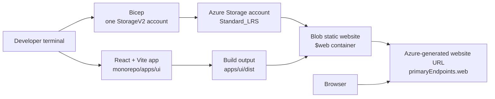

# Azure 02 - Deploy A Website To Azure Blob Static Website Hosting

## Introduction

This lesson deploys a React, TypeScript, and Vite website to Azure in the simplest low-cost way used by this course: one Azure Storage account with Blob static website hosting enabled.

The deployed site uses the Azure-generated static website URL from the storage account. The lesson stays focused on Blob static website hosting and does not add extra hosting, edge, backend, database, secrets, or monitoring resources.

The application code lives in `monorepo/apps/ui`, the Bicep template lives in `monorepo/infra`, and the Azure CLI automation lives in `monorepo/scripts`.

## Architecture



## What Azure Creates

The infrastructure is intentionally small:

- one resource group
- one Azure Storage account
- the special `$web` container created when static website hosting is enabled

The Bicep template provisions the storage account with `StorageV2` and `Standard_LRS`. The deployment script then enables static website hosting and uses `index.html` as both the index document and the 404 document so React Router routes can refresh correctly.

## Prerequisites

You need:

- Node.js
- pnpm
- Azure CLI
- an Azure subscription
- a signed-in Azure CLI session

Check your Azure CLI account:

```bash
az account show --output table
```

Sign in if needed:

```bash
az login
```

Select a subscription if your account has access to more than one:

```bash
az account set --subscription "<subscription-id-or-name>"
```

## How To Run

Run these commands from the repository root.

Install dependencies:

```bash
pnpm --dir monorepo install
```

Run the app locally:

```bash
pnpm --dir monorepo run ui:dev
```

Run local checks:

```bash
pnpm --dir monorepo run type-check
pnpm --dir monorepo run ui:build
pnpm --dir monorepo run ui:preview
```

Deploy the Azure infrastructure:

```bash
pnpm --dir monorepo run infra:deploy
```

Build and upload the website files:

```bash
pnpm --dir monorepo run deploy-website
```

Print the live Azure-generated website URL:

```bash
pnpm --dir monorepo run ui:url
```

Deploy everything in one command:

```bash
pnpm --dir monorepo run deploy-everything
```

Delete the lesson resources:

```bash
pnpm --dir monorepo run infra:destroy
```

## Configuration

The scripts use these defaults from `monorepo/scripts/config.sh`:

```bash
AZURE_LOCATION="${AZURE_LOCATION:-uksouth}"
AZURE_RESOURCE_GROUP="${AZURE_RESOURCE_GROUP:-azure02-static-website-rg}"
AZURE_DEPLOYMENT_NAME="${AZURE_DEPLOYMENT_NAME:-azure02-static-website}"
AZURE_APP_NAME="${AZURE_APP_NAME:-azure02web}"
UI_DIST_DIR="${UI_DIST_DIR:-apps/ui/dist}"
```

Override values inline when needed:

```bash
AZURE_LOCATION=westeurope AZURE_RESOURCE_GROUP=my-static-site-rg pnpm --dir monorepo run deploy-everything
```

## Project Structure

```text
.
├── README.md
├── docs
└── monorepo
    ├── apps
    │   └── ui
    │       ├── src
    │       ├── index.html
    │       ├── package.json
    │       ├── tsconfig.json
    │       └── vite.config.ts
    ├── infra
    │   └── main.bicep
    ├── scripts
    │   ├── config.sh
    │   ├── deploy-infra.sh
    │   ├── destroy-infra.sh
    │   ├── show-url.sh
    │   ├── upload-ui.sh
    │   └── what-if-infra.sh
    ├── package.json
    ├── pnpm-lock.yaml
    └── pnpm-workspace.yaml
```

## Infrastructure

`monorepo/infra/main.bicep` creates a single storage account:

```bicep
resource websiteStorage 'Microsoft.Storage/storageAccounts@2023-05-01' = {
  name: storageAccountName
  location: location
  sku: {
    name: 'Standard_LRS'
  }
  kind: 'StorageV2'
  properties: {
    allowBlobPublicAccess: true
  }
}
```

The storage account name is generated from `AZURE_APP_NAME` and the resource group id so it is globally unique and repeatable for the same resource group.

## Scripts

- `infra:deploy` creates the resource group, deploys Bicep, reads the storage account name, and enables Blob static website hosting.
- `infra:what-if` previews the Bicep deployment.
- `ui:build` builds the Vite app into `apps/ui/dist`.
- `ui:upload` uploads `apps/ui/dist` into the `$web` container.
- `ui:url` prints the storage account's `primaryEndpoints.web` URL.
- `deploy-website` builds and uploads the frontend.
- `deploy-everything` deploys infrastructure, builds the frontend, uploads it, and prints the live URL.
- `infra:destroy` deletes the resource group.

## Troubleshooting

If upload fails because the build output is missing, run:

```bash
pnpm --dir monorepo run ui:build
```

If `ui:url` cannot find a URL, deploy the infrastructure first:

```bash
pnpm --dir monorepo run infra:deploy
```

If a refreshed route such as `/cases` does not load, redeploy the infrastructure. The deployment script sets `index.html` as the static website 404 document, which lets the React app handle client-side routes.
